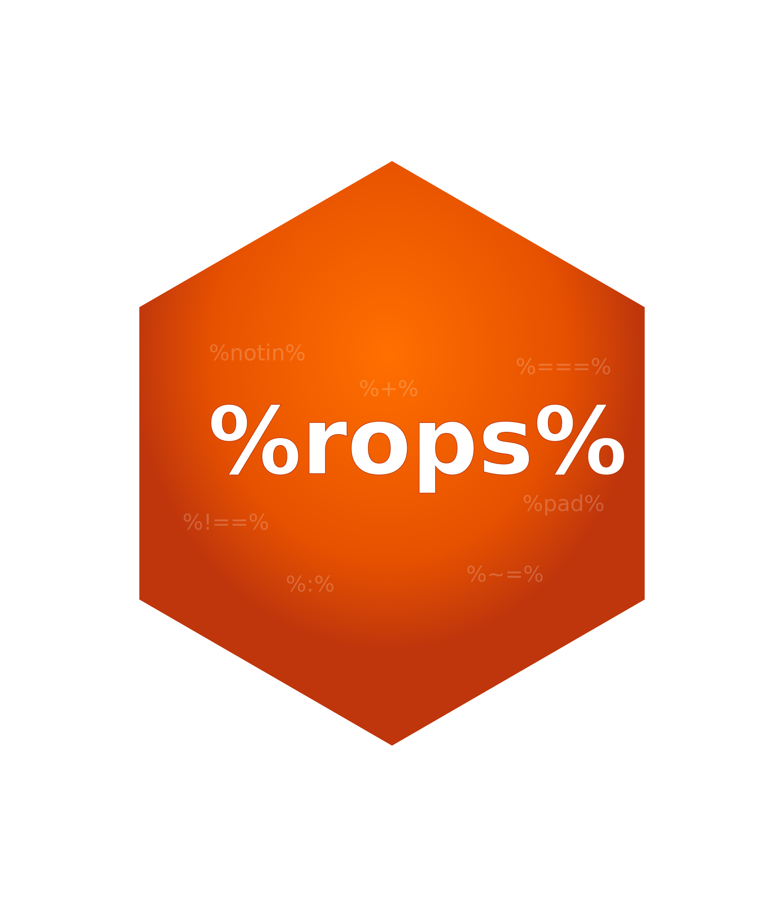

<!-- badges: start -->

<!-- badges: end -->

# R Ops (rops) 

The objective behind this package is to provide an extension to base *R*
that supplements present operators manipulations.

<figure>

<figcaption aria-hidden="true">Demo of Operators</figcaption>
</figure>

# Supported Functionality

Presently, the package has support for the following operators:

- [Null coalescing
  operator](https://en.wikipedia.org/wiki/Null_coalescing_operator):
  `%??%`
  - Operator to allow checking and substitution if a value is null
    without `if`/`else` structure
- Missing value (`NA`) coalescing operator: `ifna(x, y)`
  - Substitute value when NA is detected.
- [Is Whole Number](https://en.wikipedia.org/wiki/Integer):
  `is_whole(x)`
  - Vectorized boolean operator to assess whether value is an integer.
- Safe Sequence Generation: `from %:% to`, `safe_seq(from, to, by)`
  - Create sequences that agree with the parity of the incrementer.
- Not In Set: `x %notin% table`
  - Check to see if an element does not belong to a set.
